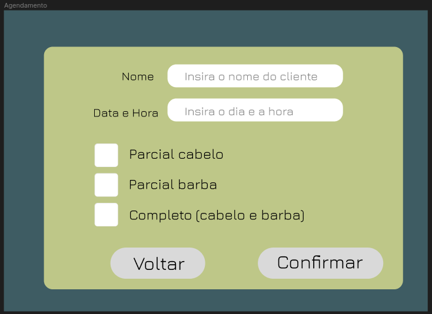

# Ativ4.EngSoft

Repositório para o desenvolvimento da prática dos requisitos

## Exercícios Propostos:

1. Definir 2 requisitos funcionais de um sistema qualquer.
2. Descrever o Caso de Uso Expandido para os 2 requisitos.
3. Descrever User Storie para os 2 requisitos.
4. Fazer o protótipo da tela para cada um dos requisitos.

Para desenvolver as questões anteriormente abordadas, consideramos como referência um sistema de agenda comercial que neste caso será uma barbearia.

### Definindo os requisitos:

Os requisitos funcionais, descritos para esse sistema, são: **Agendar um horário e Visualizar horários do dia**.

### Descrevendo os casos de uso expandido dos requisitos:

**Requisito 1:**

    • Nome: Agendar um horário.
    • Número: 01.
    • Atores: Cliente, Funcionário.
    • Finalidade: Marcar uma data e hora para visitação do cliente.
    • Visão geral: Este caso de uso tem como função efetuar  um determinado agendamento no sistema.
    • Tipo: Essencial

**Ações do atores:**

1. Cliente faz contato ou vai até a instalação e deseja marcar uma data e hora para cuidar de sua aparência.
2. Cliente informa seu nome, período de sua preferência, e o tipo de abordagem.
3. O funcionário cataloga as informações recem coletadas do cliente através do formulário em questão.

**Respostas do sistema:**

1. Exibe a tela do formulário para agendar clientes.
2. Sistema insere os dados em um calendário, marcando assim o agendamento em ordem cronológica .
3. Sistema grava informações.

**Tratamento de Exceções:**

1.1. Funcionário verifica que o periódo que o cliente deseja já está preenchido.

1.2. Sistema sugere alguns horários vagos.

2.1. Funcionário informa que não há disponibilidade naquela Data.

2.2. Sistema exibe horários disponiveis para o dia utíl seguinte.

**Requisito 2:**

    • Nome: Visualizar horários do dia.
    • Número: 02.
    • Atores: Cliente, Funcionário.
    • Finalidade: Verificar disponibilidade de horários no dia em questão.
    • Visão geral: Este caso de uso tem como função auxiliar o usuário do sistema (funcionário, no caso) a checar os períodos disponiveis na data em questão.
    • Tipo: Essencial

**Ações do atores:**

1. Cliente deseja saber a disponibilidade do barbeiro em determinada data ou deseja desmarcar/remarcar sua visita.
2. Funcionário responde ao cliente seus horários vagos/disponiveis.
3. Cliente escolhe o momento de sua preferência confirmando agendamento com o funcionário.
4. Funcionário confirma e agenda horário com cliente.

**Respostas do sistema:**

1. Sistema exibe a tela de Agendados do dia.
2. Sistema se prepara para futura inserção.
3. Sistema grava informações.
4. Sistema registra o agendamento.

**Tratamento de Exceções:**

1.1. Funcionário verifica horários vagos para remobilização do agendamento anterior.

1.2. Sistema disponibiliza tela de agendamento para alteração.

2.1. Funcionário informa ao cliente que não existe disponibilidade em tal data.

2.2. Sistema encerra o agendamento .

### Descrevendo o User Stories para os requisitos:

**Requisito 1:** < Agendar um horário >

Como um < recepcionista > eu < preciso > de < permissões > especiais para < agendar > um novo horário no sistema.

**Requisito 2:** < Visualizar horários do dia >

Como um < cliente > eu < desejo > de forma breve < saber > um horário que se adapte à minha disponibilidade para < marcar > na data de hoje.

4 - **Protótipo das telas de cada requisito:**

**Requisito:** Agendar um horário

**Requisito:** Visualizar horários do dia

